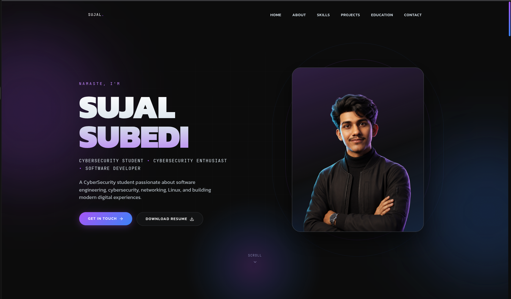

<<<<<<< HEAD
# Sujal Subedi — Cybersecurity & Technology Portfolio

<p align="center">
  <strong>Cybersecurity Student • Network Engineering Enthusiast • Software Developer</strong>
</p>

<p align="center">
  Building secure applications while exploring networks, Linux systems, cloud technologies, and cybersecurity.
</p>

<p align="center">
  <a href="https://sujalsubedi.name.np">Portfolio</a> •
  <a href="https://github.com/sujalsubedi06">GitHub</a>
</p>

---

## About Me

I am Sujal Subedi, an IT student from Nepal focused on **cybersecurity, networking, Linux systems, and secure software development**.

My journey combines software engineering with infrastructure and security concepts. I enjoy building modern applications while understanding how systems communicate, how networks operate, and how technology can be made more secure.

My current areas of interest:

- Network Engineering
- Cybersecurity
- Linux Administration
- System Security
- Secure Application Development
- Cloud Technologies
- Backend Engineering

---

# Technical Skills

## Programming Languages

- TypeScript
- JavaScript
- Dart
- Python
- SQL

## Web Development

- Next.js
- React
- Tailwind CSS
- Node.js
- REST APIs

## Mobile Development

- Flutter
- Dart

## Backend & Databases

- NestJS
- PostgreSQL
- API Architecture
- Authentication Systems
- Database Design

## Systems & Security

- Linux
- Networking Fundamentals
- TCP/IP Concepts
- Cybersecurity Fundamentals
- Secure Software Practices
- Vulnerability Analysis

## Tools

- Git & GitHub
- Docker
- VS Code
- Linux Terminal

---

# Featured Projects

## YatraPass

A smart transportation platform designed to modernize public transportation through digital technology.

### Features

- QR-based transit system
- Digital wallet architecture
- Automated fare calculation
- Trip tracking
- Secure authentication
- Scalable backend architecture

### Technology Stack

Flutter • NestJS • PostgreSQL • Next.js

---

## Krevista Systems

A technology ecosystem focused on modern cloud, AI, and software solutions.

### Focus Areas

- Cloud platforms
- AI-powered systems
- Enterprise software concepts
- Modern web architecture
- Scalable application design

---

## Cybersecurity Projects

Security-focused projects exploring practical cybersecurity concepts.

### Areas

- Phishing detection
- URL risk analysis
- Secure development
- Security automation
- System security fundamentals

---

# Portfolio Features

This portfolio website includes:

- Modern responsive design
- Dark developer-focused interface
- Live GitHub integration
- GitHub contribution heatmap
- Project showcase
- SEO optimized pages
- Performance-focused architecture
- Reusable component system

---

# Project Structure

```text
src/
├── app/              # Next.js application routes
├── components/       # Reusable UI components
├── config/           # Site configuration
├── content/          # Portfolio content
├── hooks/            # Custom React hooks
├── lib/              # Utilities and integrations
└── styles/           # Global styles
=======
# 👋 Sujal Subedi — Personal Portfolio

A modern, immersive developer portfolio showcasing my projects, skills, and passion for **cybersecurity**, **software development**, and building exceptional digital experiences.

Built with **React**, **TypeScript**, **Vite**, **Tailwind CSS**, and **Framer Motion**.

🌐 **Live Website:** https://sujalsubedi.name.np

---

## ✨ Features

- 🎨 Modern dark UI with a premium futuristic aesthetic
- 💜 Interactive cursor glow
- 🖼️ Interactive 3D hero portrait
- ✨ Smooth animations powered by Framer Motion
- 📱 Fully responsive across desktop, tablet, and mobile
- ⚡ Fast and optimized with Vite
- 🌙 Premium glassmorphism effects
- ♿ Accessibility-focused design
- 🔍 SEO optimized
- 🚀 Production-ready architecture

---

# 🎨 Design Language

Inspired by modern developer tools, terminal interfaces, and cybersecurity aesthetics.

### Highlights

- Terminal-inspired branding
- Command-line section headers
- Interactive lighting effects
- Premium dark theme
- Glassmorphism UI
- Smooth micro-interactions
- Clean and modern layouts

---

## 🎨 Color Palette

| Color | Hex |
|--------|------|
| Background | `#0C0C0C` |
| Surface | `#151515` |
| Primary Text | `#FFFFFF` |
| Secondary Text | `#D7E2EA` |
| Purple Accent | `#A855F7` |
| Blue Accent | `#3B82F6` |
| Orange Accent | `#F97316` |

---

## ✍ Typography

- **Kanit**
- **JetBrains Mono**

---

# 🛠 Tech Stack

### Frontend

- React
- TypeScript
- Vite
- Tailwind CSS

### Animation

- Framer Motion

### Icons

- Lucide React

### Tooling

- ESLint
- npm

---

# 📂 Project Structure

```text
src/
├── assets/
│   ├── images/
│   └── icons/
│
├── components/
│   ├── layout/
│   ├── sections/
│   └── ui/
│
├── data/
├── hooks/
├── pages/
├── styles/
├── types/
├── utils/
│
├── App.tsx
└── main.tsx

public/
├── favicon.png
├── manifest.webmanifest
├── robots.txt
└── resume.pdf
>>>>>>> b7a93ce (feat: initial portfolio release)
```

---

<<<<<<< HEAD
# Getting Started

## Clone Repository
=======
# 🚀 Getting Started

Clone the repository
>>>>>>> b7a93ce (feat: initial portfolio release)

```bash
git clone https://github.com/sujalsubedi06/portfolio.git
```

<<<<<<< HEAD
## Install Dependencies
=======
Navigate to the project

```bash
cd portfolio
```

Install dependencies
>>>>>>> b7a93ce (feat: initial portfolio release)

```bash
npm install
```

<<<<<<< HEAD
## Run Development Server
=======
Run the development server
>>>>>>> b7a93ce (feat: initial portfolio release)

```bash
npm run dev
```

<<<<<<< HEAD
Open:

```text
http://localhost:3000
=======
---

# 📦 Build

Create a production build

```bash
npm run build
```

Preview the production build

```bash
npm run preview
```

Run ESLint

```bash
npm run lint
>>>>>>> b7a93ce (feat: initial portfolio release)
```

---

<<<<<<< HEAD
# Available Commands

| Command | Description |
|---|---|
| `npm run dev` | Start development server |
| `npm run build` | Create production build |
| `npm run start` | Run production server |
| `npm run lint` | Run ESLint |
| `npm run type-check` | Validate TypeScript |

---

# Environment Variables

Create a `.env.local` file:

```env
GITHUB_TOKEN=your_github_token
```

Never commit:

- API keys
- Access tokens
- Database credentials
- Private environment files

---

# Career Direction

Currently building skills and exploring opportunities related to:

- Network Engineering
- Cybersecurity Engineering
- Security Operations
- Cloud Security
- System Administration
- Infrastructure Security

---

# Connect With Me

Portfolio:

https://sujalsubedi.name.np

GitHub:

https://github.com/sujalsubedi06

---

# License

This repository is publicly available for educational and technical reference.

Design, branding, and personal content remain the property of Sujal Subedi.
=======
# 🌟 Highlights

- Interactive Hero Section
- 3D Animated Portrait
- Custom Cursor Glow
- Smooth Scroll Animations
- Responsive Navigation
- Downloadable Resume
- Glassmorphism Components
- Beautiful Hover Effects
- Optimized Performance
- SEO Friendly

---

# 📸 Preview

> Homepage Preview



---

# 🎯 Purpose

This portfolio was built to:

- Showcase my projects and technical skills
- Demonstrate modern frontend development
- Highlight my cybersecurity journey
- Present my work with a polished user experience
- Continuously evolve as I learn and build new technologies

---

# 📈 Performance Goals

- ⚡ Fast page loads
- 📱 Responsive on all devices
- ♿ Accessibility compliant
- 🔍 SEO optimized
- 🚀 High Lighthouse scores

---

# 📬 Connect With Me

🌐 **Website**  
https://sujalsubedi.name.np

🐙 **GitHub**  
https://github.com/sujalsubedi06

💼 **LinkedIn**  
https://www.linkedin.com/in/sujalsubedi06/

📧 **Email**  
sujal.subedi96@gmail.com

---

# 📄 License

This project is licensed under the **MIT License**.

See the [LICENSE](LICENSE) file for details.

---

<div align="center">

### ⭐ If you found this project interesting, consider giving it a star!

**Designed & Developed by Sujal Subedi**

Made with ❤️ using React, TypeScript, Tailwind CSS, Framer Motion & Vite.

</div>
>>>>>>> b7a93ce (feat: initial portfolio release)
